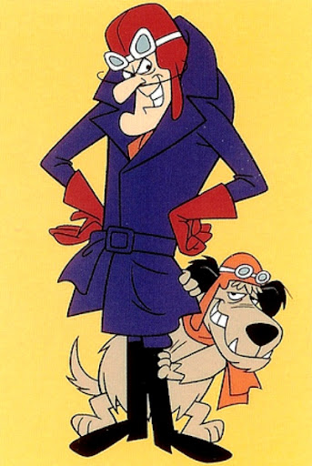

# _The Magnificent_ Journey Through Europe

- Removed the route planning stage from the start of the game
- New non-player character, **Dastardly Dan**
- 3+ Players

Dan is a freelance immigration officer who deports people travelling without visas.

> "Muhahaha! I am Dastardly Dan, the greatest immigration officer of all time! I won't rest until every last illegal tourist is deported. I've got all sorts of tricks up my sleeve to track them down and send them packing. And if anyone tries to resist, they'll have to deal with my trusty sidekick, Muttley. Together, we'll keep Europe free of unwanted visitors!"

## Setup

Dan starts at a central location on the board. Roll a dice to reveal where:

1. Budapest
2. Zurich
3. Barcelona
4. Paris
5. Berlin
6. Warsaw

Move the black figure to Dan's starting point.

One player will be marked by Dan, as indicated by the black flag. To determine the first marked player, all players roll the dice. The player with the lowest roll gets the marker.

If players are tied with rolls, roll again until one player rolls the least.

### Place cards for players

The place cards are sorted into three colours, shuffled well, and placed face down. Each player now receives one place card; these are dealt as follows: the first player receives a red one, the second green, the next yellow, the next red, and so on.

At the beginning of their first turn, each player chooses their first destination city from the top of one of the draw piles.

When place cards, do not turn them over to look at the instructions of picture cards.

## Reaching a city

If a player has less than three cities of each colour, they draw a city matching one of the colours they need from the top of one of the draw piles. This city is their next destination city.

The player keeps the place card of the city they just reached to keep track of their journey so far.

If the player has three cities of each colour, they do not draw any more cards and instead must journey towards home. Once a player reaches their home, they win the game.

## Dan's move

At the end of each round of player moves, Dan rolls to dice to  determine his moves. Dan cannot travel by air (he hates planes, at a push he will use a hot air balloon, however this antiquated form of travel is not available to him in today's Europe).
Dan can travel along any water route in two moves.

If Dan catches you, you've been kidnapped! Gadzooks! Dan has packaged you up and sent you via FedEx to a random city in Europe. Roll the dice to determine the location colour:

- Green: 1 or 2
- Yellow: 3 or 4
- Red: 5 or 6

When the colour is selected, cut the deck of the draw pile matching that colour to reveal the destination. 
Move the captured player's figure to that place card. Do not carry our any instructions found on the reverse of the place card. Add the place card to Dan's hand.

After their figure has been moved, the kidnapped player must choose another player to pass the marker to. Dan will now chase this player on his next go.

If Dan rolls a six, roll for Dan again. If Dan captures a player on his first roll, he chases the next player with his second roll.

## Bribing Dan

Before your turn, you may choose to forfeit moving your figure and instead try to bribe Dan over the phone.

If you choose to bribe Dan, roll a dice. This determines how much cash you have to bribe him with. Dan rolls his dice. This reveals his contract fee.

If you roll the same or less than his contract fee, Dan does not accept your bribe and will continue to chase you.

If you roll greater than his contract fee, Dan accepts the bribe and you can pass the marker to a player of your choice. Dan will start chasing this player on his next turn.

Even if you successfully bribe Dan, you cannot move your piece this turn.

## Winning

If Dan successfully kidnaps players 9 times throughout the game, he wins.

If a player collects 3 cities of each colour and returns home, they win the game.

